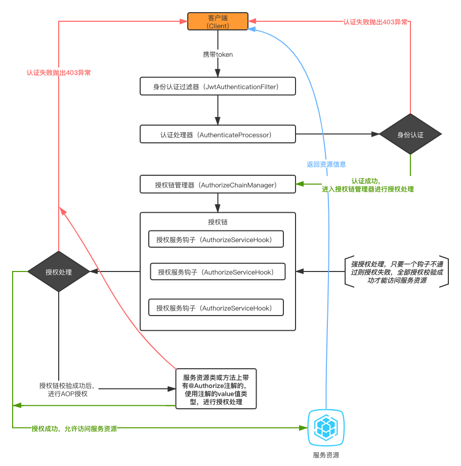

###  安全认证模块

citrus-security是基于SpringSecurity5.3.x与JWT的安全认证模块。可灵活地实现多种认证模式，适配复杂的业务安全认证需求，并支持JSON与表单的提交方式。

地址：https://github.com/Yiuman/citrus/tree/master/citrus-security/src/main/java/com/github/yiuman/citrus/security


#### 设计思路

在一些比较复杂或是比较多场景的业务系统，可能存在多种认证方式，比如公众号、小程序端访问服务资源需要微信用户登录认证；比如PC端中的账号密码进行认证，众多的认证方式层出不穷。So，为了将业务场景与安全认证抽离开来，此模块使用了**mode**进行区分各种不同认证方式,业务代码实现对应**mode**的认证方式逻辑，安全系统根据**mode**来匹配，找到支持此**mode**的业务认证实现进行认证。

> 给认证模式”mode“起个好听的名字，进行认证的时候告诉安全模块这个好听的名字，安全模块根据这个好听的名字找到对应的处理实现，处理认证

​	

#### 认证流程

##### 流程图


##### 关键类说明

- `com.github.yiuman.citrus.security.authenticate.AuthenticateController` 可配置的安全认证的入口，可通过配置`CitrusProperties`进行安全端点的配置，默认为`SecurityConstants`

- `com.github.yiuman.citrus.security.authenticate.AuthenticateProcessor`认证处理器顶层接口，默认实现为`com.github.yiuman.citrus.security.authenticate.AuthenticateProcessorImpl`

  根据当前的认证模式匹配容器中的服务类进行认证处理，认证成功后，会将身份标识与认证模式代码用于Token盐中进行生成Token

- `com.github.yiuman.citrus.security.authenticate.AuthenticateService`身份认证的顶层接口,具体的认证都在此类进行，业务需扩展认证需求，定义好认证模式代码，实现此接口即可


#### 授权流程

##### 流程图



##### 关键类说明

- `com.github.yiuman.citrus.security.jwt.JwtAuthenticationFilter` JWT身份认证过滤器，适配Security过滤链，在`UsernamePasswordAuthenticationFilter `前进行拦截处理

- `com.github.yiuman.citrus.security.authenticate.AuthenticateProcessor` 对token进行解析成身份认证信息并进行认证处理
- `com.github.yiuman.citrus.security.authorize.AuthorizeServiceHook`授权钩子，对已认证身份进行资源授权处理
- `com.github.yiuman.citrus.security.authorize.AuthorizeChainManager` 授权链管理器，用于管理程序中已实现`AuthorizeServiceHook`钩子的实现，进行授权处理


#### Security配置

```java
@Configuration
@EnableGlobalMethodSecurity(prePostEnabled = true, securedEnabled = true)
public static class StatelessSecurityConfiguration extends WebSecurityConfigurerAdapter {

        private final AuthenticationEntryPoint authenticationEntryPoint;

        private final AccessDeniedHandler accessDeniedHandler;

  			//JWT安全配置适配器，主要是将过滤器放入Security过滤链
        private final JwtSecurityConfigurerAdapter jwtSecurityConfigurerAdapter;

  			//授权配置管理器，用与解耦业务与Security的安全配置
        private final AuthorizeConfigManager authorizeConfigManager;

        public StatelessSecurityConfiguration(AuthenticationEntryPoint authenticationEntryPoint, 
                                              JwtSecurityConfigurerAdapter jwtSecurityConfigurerAdapter, 
                                              AuthorizeConfigManager authorizeConfigManager, 
                                              AccessDeniedHandler accessDeniedHandler) {
            this.authenticationEntryPoint = authenticationEntryPoint;
            this.jwtSecurityConfigurerAdapter = jwtSecurityConfigurerAdapter;
            this.authorizeConfigManager = authorizeConfigManager;
            this.accessDeniedHandler = accessDeniedHandler;
        }

        @Override
        protected void configure(HttpSecurity http) throws Exception {
            http
                    // 禁用 CSRF
                    .csrf()
                    .disable()
                    .formLogin()
                    .disable()
                    .exceptionHandling()
                    .authenticationEntryPoint(authenticationEntryPoint)
                    .accessDeniedHandler(accessDeniedHandler)
                    .and()
                    .sessionManagement()
                    .sessionCreationPolicy(SessionCreationPolicy.STATELESS)
                    .and()
                    .apply(jwtSecurityConfigurerAdapter);

            authorizeConfigManager.config(http.authorizeRequests());
        }

    }
```


#### Maven

```xml
<dependency>
  <groupId>com.github.yiuman</groupId>
  <artifactId>citrus-security</artifactId>
  <!-- 最新版本号，请见citrus主目录-->
  <version>${latest}</version> 
</dependency>
```


#### 使用教程

> 此处使用citrus-system（系统管理模块）进行说明  链接：https://github.com/Yiuman/citrus/tree/master/citrus-system

##### 1. 账号密码模式身份认证实现

- 类：PasswordAuthenticateServiceImp 
- 源码：https://github.com/Yiuman/citrus/blob/master/citrus-system/src/main/java/com/github/yiuman/citrus/system/authticate/PasswordAuthenticateServiceImpl.java


##### 2.权限AOP钩子扩展

> 大多业务中，很多资源都需要登录后才能进行访问，现定义一个登录的授权钩子，用于断言是否已经登录，若已经登录则可以进行访问，返之拒绝

- 第一步：实现AuthorizeHook接口，实现hasPermission方法

```java
public class HasLoginHook implements AuthorizeHook {

    private final UserService userService;

    public HasLoginHook(UserService userService) {
        this.userService = userService;
    }

    @Override
    public boolean hasPermission(HttpServletRequest httpServletRequest, Authentication authentication) {
        if (authentication == null) {
            return false;
        }

        return userService.getCurrentUser().isPresent();
    }
}

```

- 第二步：在需要做登录认证的类或者方法上添加注解`@Authorize`，value属性指定你的`AuthorizeHook`实现

```java
@PostMapping("/password")
@Authorize(HasLoginHook.class)
public ResponseEntity<Void> updatePassword(@Validated @RequestBody PasswordUpdateDto passwordUpdate) throws Exception {
        userService.updatePassword(passwordUpdate.getOldPassword(), passwordUpdate.getNewPassword());
        return ResponseEntity.ok();
}
```

 源码参考：https://github.com/Yiuman/citrus/tree/master/citrus-system/src/main/java/com/github/yiuman/citrus/system/hook


#### 验证码

此模块也将验证码的相关的进行了抽象，下面只对关键类进行说明，若需要详细了解请查看源码，地址:https://github.com/Yiuman/citrus/tree/master/citrus-security/src/main/java/com/github/yiuman/citrus/security/verify

##### 关键类

- `com.github.yiuman.citrus.security.verify.Verification`验证对象的顶层接口，用于抽象出验证码的行为，已实现传统的图片验证码`com.github.yiuman.citrus.security.verify.captcha.Captcha`
- `com.github.yiuman.citrus.security.verify.VerificationGenerator`验证码生成器顶层接口，抽象出生成验证码的方式
- `com.github.yiuman.citrus.security.verify.VerificationRepository`验证库顶层接口,用于存在待验证验证码
- `com.github.yiuman.citrus.security.verify.VerificationProcessor`验证码处理器，抽象出整个验证码的生成、发送、校验的生命过程
- `com.github.yiuman.citrus.security.verify.VerificationController`获取验证码的入口


