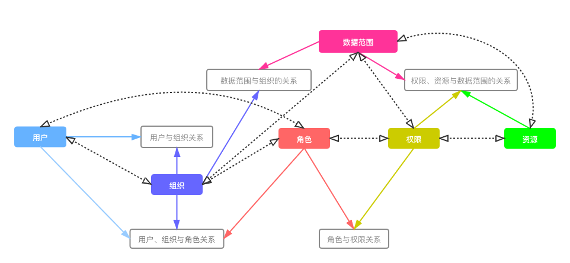
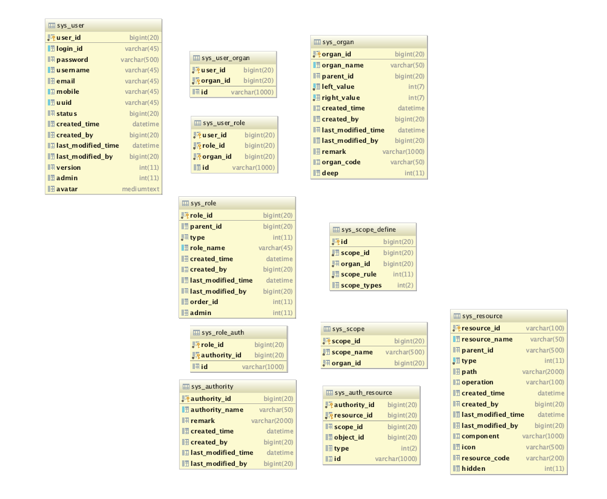

# 权限设计

## 模型说明

> 基于RBAC（基于角色的权限控制）模型进行扩展，增加了组织与数据范围，用于控制用户访问某个资源时的数据范围。

见上图，由传统RBAC的“**用户与角色**关系中增加组织”，即上图中的“**用户、组织与角色关系**”。在日常中一个用户是可拥有多个角色的，且也可能属于多个组织，但在不同的组织中的角色是不一样的。

> 比如张三所属的公司人手不足，属于开发部也属于项目部，张三写代码比较牛逼，在开发部中担当开发组件的角色，而在运维部中只是运维人员的角色。

而权限与数据这块，为了更好地控制用户可控可见的数据，在资源权限中也增加了数据范围与资源的关系。（这里的资源可指访问某个服务的资源、菜单资源、数据资源等等等）

> 刚说了张三，在开发部是开发组长，在运维部是运维人员。这里所属组织资源的数据范围控制应该要做到，在访问开发部的资源的时候，他能控制他的开发组相关的资源，而在运维部的时候只能控制他自己的资源

so，权限控制流程如下：

## 库表设计

> 库表设计没有使用外键进行关联，具体的关联使用程序进行控制。见上面的库表设计中，很多的关联关系表都有id的字段，此字段也不是主键，只用作程序的处理。

**这里只对组织机构、资源、数据范围、权限资源相关的进行说明，其他的与常规的没大多出入，根据自身业务进行调整。**

### 组织机构（sys_organ）

  组织表中的字段大多也是常规的树形结构，下面对几个重要字段作解析

  - **parent_id**  父节点
  - **left_value** 左值
  - **right_value**  右值
  - **deep**   所在树的位置深度

  组织机构树的插入、更新、删除是通过**预遍历排序算法**处理的，所以有**左右值**及**深度**字段标识。预遍历算法的好处是可以更快地查出想要的层级或是范围内的数据，而深度字段的添加是为了后面的数据范围做准备

### 资源（sys_resource）

  一切皆资源，资源可表示为某个菜单，某个操作，某个动作，某个服务，资源的设计也为树结构，但不是预遍历排序树，而是一颗简单的树，只有parent_id作关联，比如一个菜单，里面有查询列表、新增、删除等操作，此菜单则作为这些操作的父资源。

  - parent_id 父资源主键ID
  - type  资源类型  0菜单 1普通资源 2操作 -1其他
  - operation 请求操作类型  GET、POST等等
  - component  前端组件路径   资源类型为菜单时有用
  - icon  资源图标
  - resource_code 资源代码   用于标识某一资源（可重复 ）
  - hidden  表示是否隐藏

### 数据范围（sys_scope & sys_scope_define）

  数据范围分为**数据范围基本表**与**数据范围定义表**。数据范围基本表中，只简单定义了数据范围的名称与此数据范围的创建组织。而数据范围定义表才是真正的数据范围控制的细节，多个数据范围定义指向一个数据范围基本表，即多对一，然后数据范围基本表与权限资源做关联实现资源的数据范围控制。下面对数据范围定义表中的字段作下详细的说明：

  - Id	主键

  - scope_id  关联数据范围基本表

  - **organ_id**  

    **大于0**时表示对应的某个组织机构  `比如开发部的ID:1874`

    **等于0**时表示当前的用户的所属组织 `比如当前用户张三的组织为开发部`

    **小于0**表示当前用户的组织的某级组织，`比如-1表示当前用户部门的一级部门，-2表示当前用户部门的二级部门，张三所属的开发部为二级部门，开发部上面的部门为公司，公司则为一级部门，当数据范围定义的organ_id=-1时，则代表公司`
    
  - scope_rule  数据范围规则  **0表示包含  1表示排除**
  
  - scope_types 数据范围的类型  
  
    这一是多选的枚举值，有三个，分别为 **(0,"自身")**、**(1,"包含子")**、**(2,"包含父")**
  
    此字段的存入的值是多选项所在下标的**2的N次方**，`比如选择了0与1，则是2º+2¹，存入的值为3`

### 权限资源（sys_auth_resource）

  在权限与资源的关系中增加了数据范围的关联，用于处理某个资源的数据范围。

  - scope_id  关联的数据范围基本表
  - resource_id  关联的是具体的资源
  - type  冗余资源表中的type字段，表示资源的类型
  - object_id  关联的对象，如果资源类型为"操作",即此object_id关联的对象为该操作对应的资源主键ID`比如有一个菜单资源，该菜单有'新增'、'删除'等操作，此数据记录存的是操作类型的权限资源数据，即resource_id为该操作类型的资源id，object_id则为该操作类型的主资源Id`

## 数据范围的控制实现

> 通过上面的库表设计中可知，用于控制用户的访问资源的数据范围的重要表是`sys_scope`与`sys_scope_define`两个库表，下面对控制流程进行详细梳理

> 见上图，当数据范围定义中的organ_id大于0时，匹配的就是所属的机构的ID，根据数据范围类型去查出符合的组织，再根据包含/排除的规则去添加或者移除总的资源数据范围集合。当数据范围定义中的organ_id等于0时，则表示为当前用户的组织，根据当前用户的所属组织去再走一次organ_id>0的流程。最特殊的情况是当organ_id小于0的时候，此时的organ_id的-N，代表的是当前用户所属组织的N级部门，比如当前用户的组织为开发部深度为2，此数据范围定义的organ_id为-1,则会找开发部的所属树的深度为1的节点组织ID，再根据此ID去走organ_id>0的流程。

>此处若要控制的个人的数据，可以在sys_scope_define中添加一个是否“**只能操作个人数据**”的控制字段进行控制，只需要在判断organ_id>0的的流程前处理即可

​    

​    